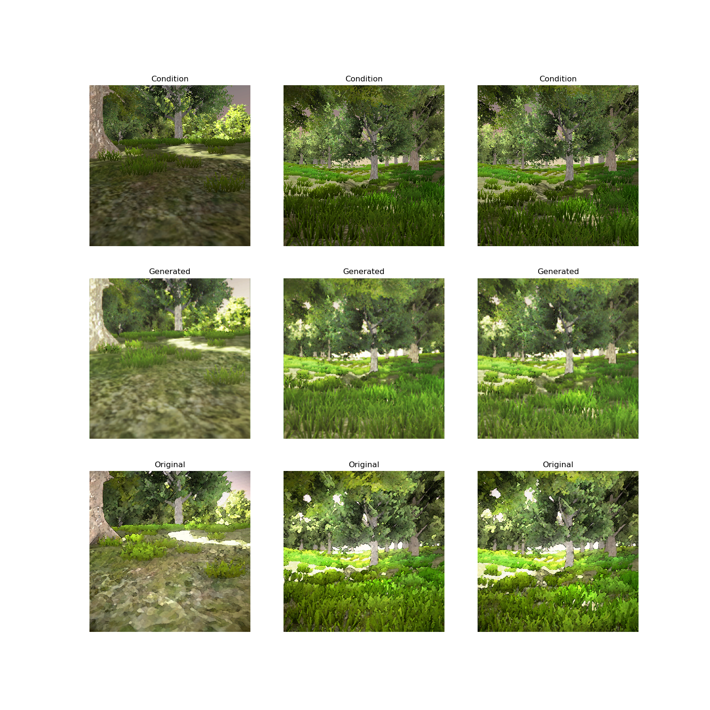
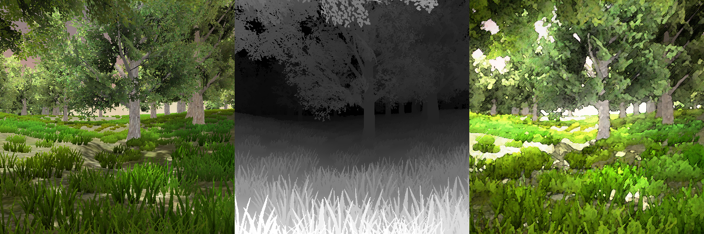
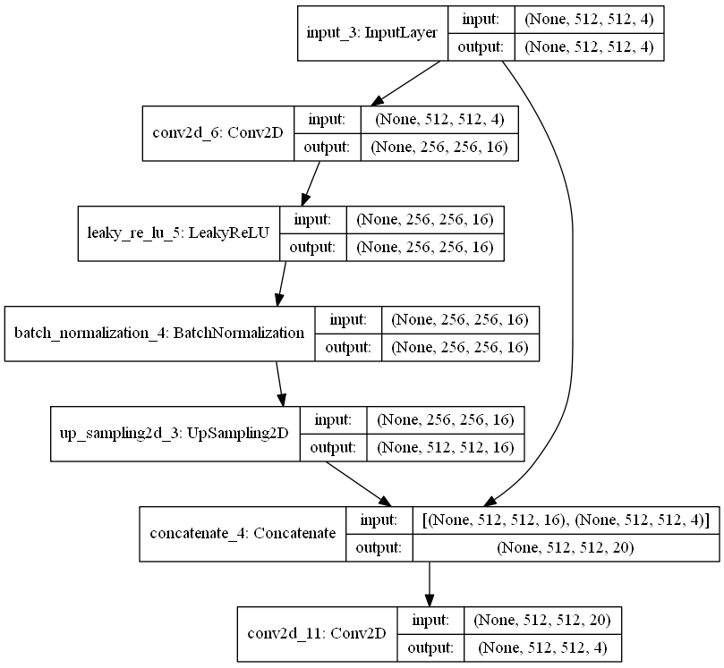

Neural Network Post Processing
========

Post Processing for Unity using Convolution Neural Network. CNN Model trained with pix2pix/GAN
  
[](http://www.youtube.com/watch?v=qYcST5reOzY "NNPP")

Run ~60fps on GTX980

## How to Run:

Open ***HirezScene*** scene and run!

### Requirement
* Unity 2018.2+
* Compute Shader support (DX11+, Vulkan, Metal)

## For Your Project:

### Ideal Pipeline 

* Render the scene with standard shading, take many screenshots
* Use photoshop/painting to modify the screenshots, create your paired training data
* Train the model with GAN/pix2pix
* Export the model to Unity and use it in PostProcess V2 


### How to Train your model:

1. Prepare your training data:
	* Add a ***TrailRecorder*** to your Character Controller, run the game. Your trail will be saved.
	* Add a ***TrailPlayer*** to you Character Controller, link the trail record, disable ***TrailRecorder***, play the game. Use UnityRecorder to save color frames, naming: image_color_XXXX.png
	* With ***TrailPlayer*** on, add a ***RenderDepth*** component, play the game. Use UnityRecorder to save depth frames, naming: image_depth_XXXX.png
	* Make your stylish action in Photoshop, batch on all your screenshots and saves, naming: image_out_XXXX.png
	* Copy all color/depth/out file to "NNTrainer/datasets/(yourdatasetname)/source"
	* edit the data_prepare.py file to your own dataset name
	* run ```python data_prepare.py``` to generate training datasets
The training data should like this:

2. Train
	* edit the train.py file to your own dataset name, and modify the generator network.
	* run ```python train.py``` to train your model
	* Currently the model is:
  
	* During training, model will export predicted pictures in "NNTrainer/images/(yourdatasetname)"
3. Export
	* run ```python exporter.py``` to export your model to Unity
4. Run
	* In Unity, Open ***HirezScene*** scene and run!

### Requirement
* Python 3.6
* Tensorflow 1.10
* Keras 2.2.4


Reference
========

* https://github.com/eriklindernoren/Keras-GAN  
* https://github.com/keijiro/Pix2Pix
